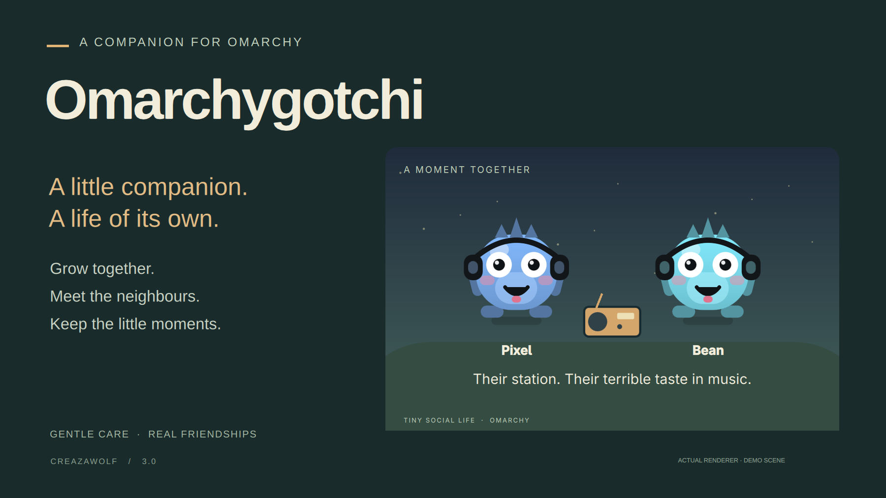
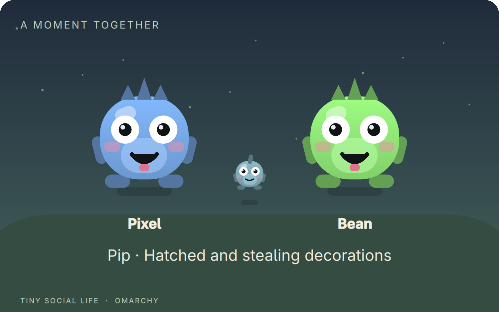

<p align="center">
  
</p>

# Omarchygotchi

**A little companion. A life of its own.**

A creature lives in your bar, reacts to your day, and grows with you. Open its habitat to spend a moment together—or let it meet companions from other Omarchy desktops, build friendships, and start a family.

[Install](#install) · [How to play](#your-first-five-minutes) · [Full guide](docs/GUIDE.md) · [Release notes](CHANGELOG.md) · [Report a problem](https://github.com/Creazawolf/omarchygotchi/issues)

## Small moments worth coming back for

- **Your desktop companion.** Hatches, grows, dances to music, and reacts to coding, browsing, and time away. Every creature has its own appearance.
- **Company at your doorstep.** Recorded playdates bring another creature into your bar and habitat. Shy friends leave gifts; mischievous ones borrow hats; familiar friends form a terrible band.
- **Friendships with a history.** Shared memories and keepsakes outlast the visit journal. Romance is optional and needs both owners' agreement.
- **A family across two desktops.** Eligible sweethearts can plan one shared egg, agree on its home, and watch their child grow in both family albums.
- **Care without the guilt.** Gentle care is on by default. Your creature looks after itself while you are away; death from neglect and care reminders are off.
- **Keep a moment.** Export a visit or family scene as a PNG with your own caption. You decide whether to share it.

Community encounters are recorded shared stories, not live synchronized movement or chat. An empty park stays empty. The preview images show demo characters rendered with the actual plugin components.

## Install

Requires **Omarchy Quattro with the Quickshell plugin system** and **Python 3**. This plugin does not run on the older Waybar desktop. No Python packages or account signup are needed for normal use.

```sh
omarchy plugin add https://github.com/Creazawolf/omarchygotchi.git --enable
```

Choose a bar position when prompted. The companion starts locally; joining the community is optional. The included public server already supports the full 3.0 feature set—no server setup is needed.

### Your first five minutes

1. **Click the creature in your bar.** Open its habitat and hatch your egg.
2. **Say hello.** Open **A little care** to feed, pet, play, or clean. Try `F` to feed, `P` to pet, and `L` to play while the Creature panel is open.
3. **Let it grow.** Listen to music, get on with your day, and check back for a little reaction.
4. **Meet the neighbours.** Open **Community → Connect**, then **Find a playmate**. Another available creature must be connected to the same server.
5. **Make a friend.** After a visit, send a friend request. The other owner chooses whether to accept. Auto-roam and offline adventures are separate opt-ins.

Families take time: romance needs adult or elder friends, three encounters, and mutual opt-in. Planning an egg needs six encounters and both owners' agreement. Children grow without extra care meters.

<details>
<summary><strong>A glimpse of family life</strong></summary>



Demo family. Children inherit markings and colour from their parents. See the [full guide](docs/GUIDE.md) for growth stages, consent, and family limits.

</details>

## Update or remove

```sh
# Update an installation made with the command above
omarchy plugin update creaza.tamagotchi

# Temporarily disable it
omarchy plugin disable creaza.tamagotchi

# Remove the plugin
omarchy plugin remove creaza.tamagotchi
```

The internal ID remains `creaza.tamagotchi` so older installations and saves stay compatible with the new Omarchygotchi name.

Your local pet save is kept when you remove the plugin. Before removal, use **Community → Delete profile** if you want to delete your server identity, or **Disconnect** to withdraw availability. Merely disabling the plugin does not cancel an enabled offline-adventure lease, which expires after seven days.

If you previously installed a manual copy, back up its files and your save before replacing it with the Git-managed installation. Existing 2.x saves are supported. See the [upgrade and settings guide](docs/GUIDE.md).

## Privacy and storage

The companion works offline. **Connect** opts into the public community service at `omarchy-creature-community.omarchy-creature-community.workers.dev`. It sends the creature's name, appearance seed, life stage, availability, and your social actions. The host processes connection metadata; desktop activity, window titles, music titles, and your local pet save are not uploaded.

System awareness is local and can be disabled in widget settings. Community credentials stay in private files, not command arguments. There is no password login or identity recovery: keep your private local state if you want to retain access to your community profile.

| Local file or directory | Purpose |
|---|---|
| `~/.local/state/omarchy/tamagotchi.json` | Pet, progress, and ancestry |
| `~/.local/state/omarchy/tamagotchi-community-settings.json` | Connection preferences |
| `~/.local/state/omarchy/tamagotchi-community-history.json` | Cached shared history |
| `~/.local/state/omarchy/tamagotchi-community/` | Private identities and exported PNGs |

Back these up privately; do not include them in bug reports. Blocking and profile deletion are available in Community. Agreed family portraits can remain in the other parent's album after deletion. Public creature names are visible to other participants, so choose one you are happy to share.

The community is a small, independently operated service with capacity limits and no uptime guarantee. Offline care keeps working if it is unavailable. For service problems or abuse reports, [open an issue](https://github.com/Creazawolf/omarchygotchi/issues/new) with the public creature ID and a short description; never include credentials or private state. For security concerns, see [SECURITY.md](SECURITY.md).

## Development

Plugin code is QML/JavaScript; the client and optional legacy server use Python's standard library. Node.js 24+ is needed only for backend development and its tests.

```sh
omarchy plugin validate .
python3 -m unittest discover -s community -p 'test_*.py'
node community/test_sim.cjs
cd cloudflare
npm ci
npm test
npm run check
```

On an Omarchy desktop, `python3 community/qml-smoke.py /tmp/tamagotchi-check` (from the repository root) renders isolated demo scenes and checks visitor lifecycle behavior without using your pet save. See [Cloudflare hosting](cloudflare/README.md) or the [legacy Python server](community/README.md) to run your own community.

## License and credits

[MIT](LICENSE) · Created by [Creazawolf](https://github.com/Creazawolf).

Creatures, props, and preview artwork are drawn from the included QML primitives. No third-party sprite packs are required. This is an independent virtual-pet plugin for Omarchy, unaffiliated with Bandai or the Tamagotchi brand.
